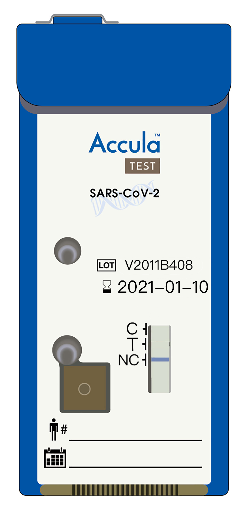

# Tesseract OCR for COVID-19 Test Cartridge Scanning

### This repository contains code and test images to run optical character recognition with Tesseract. The program, taking image and threshold arguments, can scan each of the images and identify the result of the COVID test. The cartridges themselves are designmed by MESA Biotech and Accula.

  

 
 **A video demonstration and instructions on using can be found in my YouTube video here:
 
